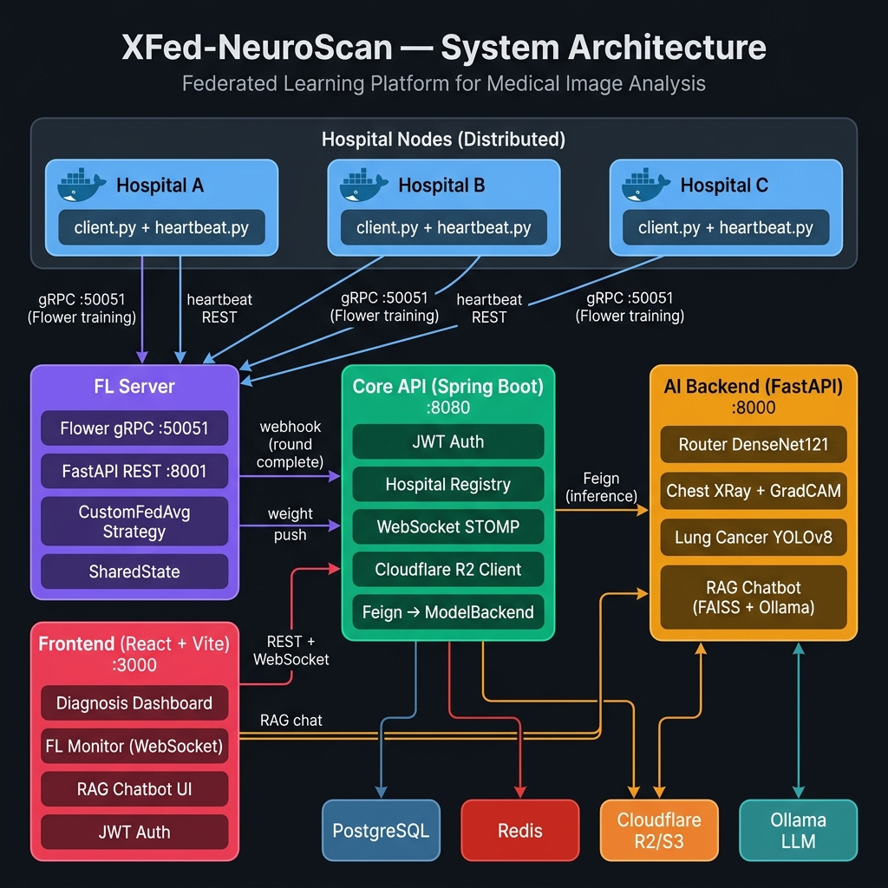

# XFed-NeuroScan

> A privacy-preserving **Federated Learning** platform for AI-assisted medical image analysis.

Distributed hospitals train deep learning models on their local patient data — raw images never leave the hospital. The platform combines a Flower-based FL engine, a Spring Boot orchestration backend, a multi-model AI inference service, and a React dashboard.

---

## System Architecture



Hospital nodes send **both** gRPC training traffic and REST heartbeats directly to the **FL Server**. The FL Server then notifies the Core API (Spring Boot) via webhook on round completion, and pushes aggregated weights to the AI Backend.

---

## My Role

I'm responsible for the **`core-api`** (Spring Boot orchestration backend) and **`frontend`** (React dashboard) — covering authentication, hospital onboarding, FL round orchestration, and real-time dashboards. The AI/RAG pipeline (`ai-backend`) and FL aggregation engine (`fl-server`) were built by other team members.

---

## Repository Structure

This repo is a **Git submodule umbrella** — each service is tracked as a submodule.

| Submodule     | Repository                                                                         | Tech                                           |
| ------------- | ---------------------------------------------------------------------------------- | ---------------------------------------------- |
| `core-api/`   | [GradProjectBackend](https://github.com/Abdo5200/GradProjectBackend)               | Spring Boot 3.5 · Java 21 · PostgreSQL · Redis |
| `ai-backend/` | [ModelBackend](https://github.com/Abdo5200/ModelBackend)                           | FastAPI · TensorFlow · PyTorch · YOLOv8 · RAG  |
| `fl-server/`  | [Federated-Learning-Server](https://github.com/Abdo5200/Federated-Learning-Server) | Flower · FastAPI · CustomFedAvg                |
| `frontend/`   | [GradProjectFrontend](https://github.com/Abdo5200/GradProjectFrontend)             | React 18 · Vite · TypeScript · SockJS/STOMP    |

---

## Key Features

- **Privacy-first FL** — FedAvg with early stopping, weight rollback, encrypted weight transfer (AES), and on-demand round triggering via `SharedState.trigger_event`.
- **Dual-model FL** — simultaneously supports DenseNet121 (chest disease) and YOLOv8 (lung cancer) aggregation with per-model performance gating before hot-reloading the production model.
- **Smart AI pipeline** — a DenseNet121 router auto-classifies uploads as chest/lung/invalid and routes to the appropriate specialist model (Grad-CAM heatmap or YOLO detection).
- **RAG medical chatbot** — LangChain + Ollama (`qwen2.5:3b`) + FAISS with multi-category knowledge bases, session history, and streaming responses.
- **Hospital client packaging** — admin registration auto-compiles a ready-to-run Docker ZIP (pre-filled credentials, `client.py`, `heartbeat.py`, certs, data folders).
- **Real-time dashboard** — STOMP/SockJS WebSocket stream for live hospital connectivity and FL round status.
- **Multi-session JWT** — multi device login is supported.

---

## Service Ports

| Service        | Port  | Protocol         |
| -------------- | ----- | ---------------- |
| Frontend       | 3000  | HTTP             |
| Core API       | 8080  | HTTP / WebSocket |
| AI Backend     | 8000  | HTTP             |
| FL Server REST | 8001  | HTTP             |
| FL Server gRPC | 50051 | gRPC (TLS)       |

---

## Getting Started

### Clone with submodules

```bash
git clone --recurse-submodules https://github.com/Abdo5200/XFed-NeuroScan.git
# or, after a plain clone:
git submodule update --init --recursive
```

### Prerequisites

- Java 21, Python 3.10+, Node 20+, Docker
- PostgreSQL, Redis, Cloudflare R2 (or any S3 bucket)
- Ollama with `qwen2.5:3b` (`ollama pull qwen2.5:3b`)

### Configure each service

```bash
cp core-api/secrets.properties.example   core-api/secrets.properties
cp ai-backend/.env.example               ai-backend/.env
cp frontend/.env.example                 frontend/.env
# create fl-server/.env manually (see fl-server/README.md)
```

### Run locally (in order)

```bash
# 1 — Core API
cd core-api && ./mvnw spring-boot:run          # :8080

# 2 — AI Backend
cd ai-backend && pip install -r requirements.txt && python main.py   # :8000

# 3 — FL Server
cd fl-server/src && python main.py             # gRPC :50051  REST :8001

# 4 — Frontend
cd frontend && npm install && npm run dev      # :3000
```

---

## API Quick Reference

### Core API `:8080`

|        | Endpoint                                     |                                        |
| ------ | -------------------------------------------- | -------------------------------------- |
| `POST` | `/auth/login` `/auth/refresh` `/auth/logout` | JWT auth                               |
| `POST` | `/api/v1/hospitals/register`                 | Register hospital, generate client ZIP |
| `GET`  | `/api/v1/hospitals/{id}/download-client`     | Download hospital package              |
| `POST` | `/api/v1/fl/rounds/start`                    | Trigger FL round                       |
| `WS`   | `/ws-status` → `/topic/hospitals/status`     | Live connectivity feed                 |

### AI Backend `:8000`

|        | Endpoint                       |                                                  |
| ------ | ------------------------------ | ------------------------------------------------ |
| `POST` | `/api/v1/process-image`        | Router → Chest/Lung model (unified)              |
| `POST` | `/api/v1/reload-model`         | Push aggregated FL weights, hot-reload if better |
| `GET`  | `/api/v1/model-weights`        | Download encrypted weights for FL init           |
| `POST` | `/rag/chat` `/rag/chat/stream` | RAG chatbot                                      |

### FL Server `:8001`

|        | Endpoint                         |                            |
| ------ | -------------------------------- | -------------------------- |
| `POST` | `/api/v1/rounds/start`           | Trigger Flower round       |
| `POST` | `/api/v1/client/heartbeat`       | Receive hospital heartbeat |
| `GET`  | `/health` `/api/v1/round-status` | Status                     |

---

## Submodule READMEs

Each service has its own detailed README:

- [core-api/README.md](core-api/README.md)
- [ai-backend/README.md](ai-backend/README.md)
- [fl-server/README.md](fl-server/README.md)
- [frontend/README.md](frontend/README.md)
- [Hospital client template](core-api/hospital-client-package-template/README.md)
